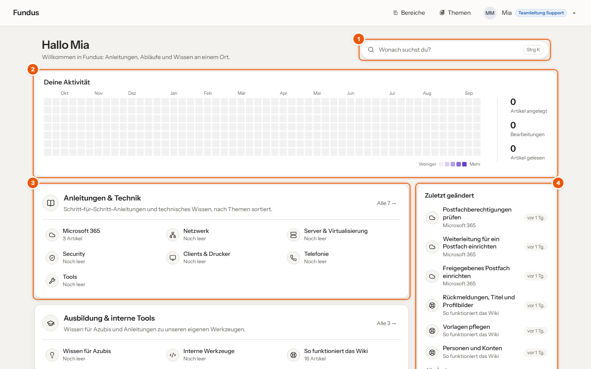
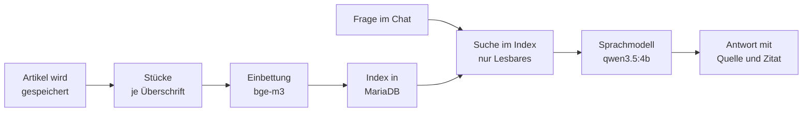
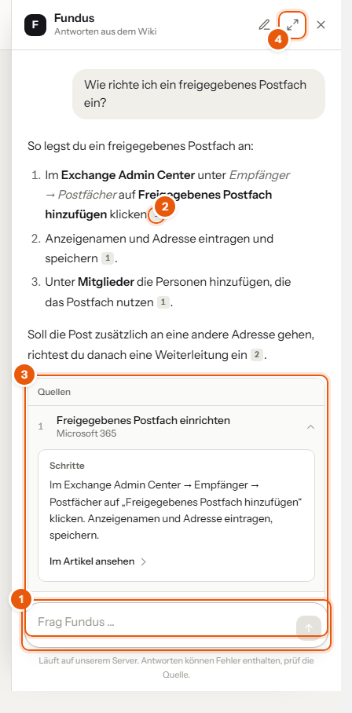
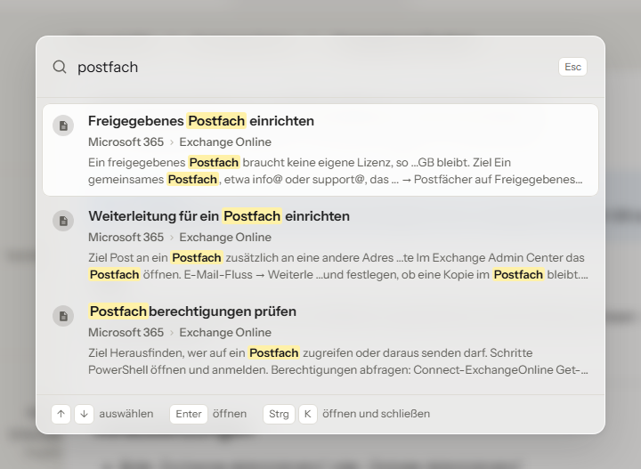

# Fundus

**Ein Firmenwiki mit KI-Suche zum Selbstbetreiben, dessen Inhalte das eigene Netz nicht verlassen.**

[](https://github.com/SergeyZakh/fundus/actions/workflows/pruefen.yml)
[](https://github.com/SergeyZakh/fundus/releases/latest)
[](LICENSE)
[](#was-im-haus-bleibt)

Fundus ist ein Theme für [BookStack](https://www.bookstackapp.com/) mit einem fertigen
Docker-Compose-Stapel aus Wiki, Datenbank, draw.io, Texterkennung für Anhänge, Sprachmodell und
nächtlicher Sicherung. Der KI-Chat „Frag Fundus“ beantwortet Fragen aus den Artikeln, und zwar nur
aus denen, die die fragende Person auch selbst öffnen darf.

> [!TIP]
> Keine technischen Vorkenntnisse? **[Erste Schritte](docs/START.md)** erklärt jeden Schritt
> einzeln, von Docker Desktop bis zum eingerichteten Wiki auf einem Windows-Rechner.

> [!CAUTION]
> Fundus ist für den Betrieb im eigenen Firmennetz gedacht. Ich rate davon ab, das Wiki mit echten
> Inhalten ohne Reverse Proxy mit TLS offen ins Internet zu stellen. Probier es zuerst mit den
> Beispielinhalten aus, bevor echtes Firmenwissen hineinkommt, und richte die Sicherung außer Haus
> ein, bevor du dich darauf verlässt.

**Anleitungen:** [Erste Schritte](docs/START.md) (ohne Vorkenntnisse, Schritt für Schritt) ·
[Entwicklung und Betrieb](docs/ENTWICKLUNG.md) · [Mitmachen](CONTRIBUTING.md) ·
[Änderungen](CHANGELOG.md) · [Sicherheit](SECURITY.md)

---

## Inhalt

[Zwei Betriebsarten](#zwei-betriebsarten) · [Warum?](#warum) ·
[Wie die KI arbeitet](#wie-die-ki-arbeitet) · [Funktionen](#funktionen) ·
[Voraussetzungen](#voraussetzungen) · [Schnellstart lokal](#schnellstart-lokal) ·
[Betrieb](#betrieb) · [Was im Haus bleibt](#was-im-haus-bleibt) · [Aufbau](#aufbau) ·
[Anpassen und erweitern](#anpassen-und-erweitern) · [Mitmachen](#mitmachen) · [Lizenz](#lizenz)

## Zwei Betriebsarten

| | Auf dem eigenen Rechner | Im Betrieb auf einem Server |
| --- | --- | --- |
| **Für** | ausprobieren, entwickeln, Inhalte vorbereiten | Firmen, die ihr Wissen an einem Ort sammeln |
| **Start** | `docker-compose.lokal.yml`, fertig unter `localhost:6875` | `docker-compose.yml` hinter einem Reverse Proxy mit TLS |
| **Anmeldung** | lokales Konto in BookStack | Firmenkonten über OIDC, Keycloak-Realm liegt bei |
| **Sicherung** | nächtlich auf dem Rechner | nächtlich, dazu eine verschlüsselte Kopie außer Haus per rclone |
| **Sprachmodell** | Ollama im Stapel (Modelle rund 4 GB) | Ollama im Stapel oder auf einem vorhandenen Server |



1. Das **Suchfeld** öffnet die Schnellsuche, genau wie `Strg` + `K`.
2. **Deine Aktivität** zeigt, was du in zwölf Monaten angelegt, bearbeitet und gelesen hast. Das
   siehst nur du.
3. Die **Bereiche** stehen mit ihren Themen da, ein Klick öffnet das Thema direkt.
4. Die **Listen** führen die Werkzeuge der Firma, zuletzt Geändertes, deine Entwürfe und Favoriten.

## Warum?

Ein Wiki hilft nur, wenn man darin auch findet, was man sucht, und wenn niemand befürchten muss,
dass die Inhalte bei einem fremden Anbieter landen.

Fundus setzt deshalb auf BookStack und ergänzt, was im Alltag fehlt, nämlich eine KI, die aus
den eigenen Artikeln antwortet und die Quelle nennt, Rückmeldungen unter jedem Artikel,
Prüffristen gegen veraltetes Wissen und ein Handbuch, das neue Kolleginnen und Kollegen selbst
lesen können.

> [!IMPORTANT]
> Antworten der KI sind **Hinweise, keine Freigabe**. Unter jeder Aussage steht die Quelle; lies
> den Artikel, bevor du danach handelst. Das Wiki merkt sich jede Fassung, Ändern ist also
> ungefährlich.

## Wie die KI arbeitet



Das Indexieren läuft in der Warteschlange; Speichern wartet nie auf die KI. Gesucht wird
ausschließlich in Artikeln, die BookStacks eigene Sichtbarkeitsprüfung freigibt, also mit
derselben Prüfung wie beim Öffnen.

## Funktionen

- **KI-Chat „Frag Fundus“.** Beantwortet Fragen aus den Artikeln, die die fragende Person lesen
  darf, nennt die Quellen und springt auf Klick zur Fundstelle im Artikel.

- **Suche mit `Strg` + `K`** über alle Artikel, Themen und Bereiche, mit Pfad und Textausschnitt.

- **Rückmeldungen.** „War das hilfreich?“ und „Veraltet melden“ unter jedem Artikel; wer den
  Artikel bearbeiten darf, sieht Zahlen und offene Hinweise und hakt sie ab.

- **Prüffristen.** Artikel werden nach einem einstellbaren Intervall zur Prüfung fällig.
  Verantwortliche sehen das auf der Startseite und im Chatfenster.

- **Startseite und Lesen.** Bereiche mit ihren Themen, deine Aktivität der letzten zwölf Monate,
  Links zu den Werkzeugen der Firma; im Artikel Stand und Lesezeit, dazu ein Zen-Modus, der alles
  bis auf den Text ausblendet.

- **Fundus meldet, was ansteht.** Wird einer deiner Artikel als veraltet gemeldet oder ist eine
  Prüfung fällig, steht das am Chatknopf, ohne dass jemand eine Mail schreiben muss.

- **Texterkennung.** Text aus hochgeladenen PDFs und Bildern wird durchsuchbar und steht auch der
  KI zur Verfügung. Nimmt man ein Bild aus dem Artikel, verschwindet auch sein Text.

- **Sicherung.** Nächtlicher Dump von Datenbank und Uploads, auf Wunsch verschlüsselt außer Haus
  per rclone (SFTP, S3, WebDAV, SMB). Wiederherstellung per Skript.

- **Anmeldung über OIDC.** Keycloak-Realm liegt bei, Authentik und Entra ID sind vorbereitet; die
  Rollen folgen den Gruppen des Anmeldedienstes.

- **Einrichtung als Code.** Rollen, Bereiche, Vorlagen und ein Handbuch für Mitarbeitende
  entstehen per Skript, nicht per Klickstrecke.

> [!NOTE]
> Erprobt ist die Anmeldung bisher **mit Keycloak**. Authentik und Entra ID sprechen dasselbe
> Protokoll (OIDC), sind hier aber noch nicht durchgetestet.

Den Chat öffnet der runde Knopf mit dem **F** unten rechts.



1. Die **Quellennummer** zeigt bei jeder Aussage, aus welcher Stelle sie stammt.
2. Unter **Quellen** klappt ein Klick das wörtliche Zitat auf, **Im Artikel ansehen** öffnet die
   Stelle.
3. Das **Vollbild** zeigt frühere Gespräche und alle Quellen des Gesprächs.

`Strg` + `K` (am Mac `Cmd` + `K`) öffnet die Schnellsuche von jeder Seite aus. Die Treffer
erscheinen beim Tippen, mit Pfad und Textausschnitt; `Enter` öffnet, `Esc` schließt.



BookStack selbst bleibt unverändert. Das Theme hängt eigene Bausteine an vorhandene Views an und
nutzt überall BookStacks Rechteprüfung.

## Voraussetzungen

| | |
| --- | --- |
| **Docker** | mit Docker Compose v2 |
| **Python** | 3.10 oder neuer, nur für die Einrichtungsskripte (Standardbibliothek) |
| **Für den KI-Chat** | rund 8 GB Arbeitsspeicher und 5 GB Platz für die Modelle; eine NVIDIA-Karte beschleunigt die Antworten, ist aber nicht nötig |
| **Für Entwicklung** | Node.js 22 und Chrome oder Chromium (Rauchtest, Handbuch-Bilder, PDF der Doku) |

Die Oberfläche ist deutsch (Du-Form).

## Schnellstart lokal

```bash
python skripte/env-anlegen.py --lokal
docker compose -p fundus -f docker-compose.yml -f docker-compose.lokal.yml up -d
```

Nach etwa zwei Minuten läuft das Wiki unter <http://localhost:6875>. Die erste Anmeldung geht mit
`admin@admin.com` und `password`, beides gleich danach ändern.

Rollen, Bereiche und Vorlagen einrichten (API-Token unter *Einstellungen → Benutzer → Admin →
API-Token* anlegen):

```bash
BOOKSTACK_URL=http://localhost:6875 BOOKSTACK_TOKEN_ID=… BOOKSTACK_TOKEN_SECRET=… \
  python skripte/einrichten.py --beispiele
```

`--beispiele` legt zusätzlich drei Beispielartikel und zwei Beispielkonten (ohne Passwort) an.

<details>
<summary><strong>KI-Chat in Betrieb nehmen</strong></summary>

<br>

Den Chat bedient der Dienst `ollama` im Stapel. Beim ersten Start lädt `ollama-modelle` die
Modelle `qwen3.5:4b` und `bge-m3` (rund 4 GB) und beendet sich danach. Ist das geschehen
(`docker compose -p fundus logs ollama-modelle`), einmal den Index über die vorhandenen Artikel
bauen:

```bash
docker exec -u abc -w /app/www fundus-wiki-1 php artisan fundus:ki-index
```

**Ein vorhandenes Ollama statt des Containers:** `OLLAMA_URL` in `.env` auf dessen Adresse
setzen, etwa `http://host.docker.internal:11434`. **Ohne KI-Chat:** `OLLAMA_URL=` leer lassen.

</details>

## Betrieb

Der Stapel läuft hinter einem Reverse Proxy mit TLS (Caddy, nginx, Traefik …). Nach außen offen
sind nur Wiki und draw.io, als Vorgabe nur für den Server selbst (`127.0.0.1:6875` und `:6876`);
der Proxy leitet die Adressen dorthin weiter.

`python skripte/env-anlegen.py` erzeugt eine `.env` mit Zufallswerten für alle Schlüssel und
Passwörter; Adressen, Anmeldung und Sicherungsziel werden danach angepasst. Alle Variablen sind
in [.env.example](.env.example) erklärt.

Ersteinrichtung, Anmeldung, Update, Sicherung und Wiederherstellung beschreibt die
[Entwicklerdoku](docs/ENTWICKLUNG.md), Kapitel „Betrieb“.

## Was im Haus bleibt

- **Keine Anfragen nach außen.** Schrift im Theme, eigenes draw.io, kein Gravatar. Einzige
  Ausnahme ist der Dienst `ollama-modelle`, der beim ersten Start die Modelle von ollama.com
  lädt. Fragen und Artikel gehen nie hinaus.

- **Die KI sieht nur, was die fragende Person sieht.** Jede eigene Abfrage läuft über BookStacks
  `scopes('visible')`. Listen, Suche und Chat zeigen nie mehr, als sich auch öffnen ließe.

- **Gespräche liegen im Browser** (`localStorage`) und werden beim Abmelden gelöscht.

- **Nur zwei Ports, als Vorgabe nur lokal.** Datenbank, Texterkennung und Ollama haben keinen
  Port nach außen; alle Dienste laufen mit `no-new-privileges`.

> [!WARNING]
> Text aus Anhängen und Bildern landet über die Texterkennung im Suchindex und bei der KI. Wer
> einen Screenshot mit Zugangsdaten hochlädt, macht sie damit durchsuchbar. Deshalb hat das
> Handbuch ein eigenes Kapitel: **was nie ins Wiki gehört**.

## Aufbau

| Ordner | Inhalt |
| --- | --- |
| `theme/fundus/` | Theme: `functions.php` als Einstieg, Bausteine, `wiki.js`, `wiki.css`, KI-Chat, Rückmeldungen, Prüfung, Begriffe |
| `skripte/` | Einrichtung, `.env` anlegen, Sicherung und Wiederherstellung, Handbuch einspielen, Rauchtest, Tests |
| `ocr/`, `sicherung/` | eigene Images für Texterkennung und Sicherung |
| `keycloak/` | Realm-Vorlage für die mitgelieferte Anmeldung |
| `handbuch/` | Handbuch „So funktioniert das Wiki“ für Mitarbeitende, wird ins Wiki eingespielt |
| `vorlagen/` | Artikelvorlagen (Anleitung, Prozess, Checkliste, Kundenüberblick) |
| `docs/` | Entwicklerdoku und Erste Schritte; PDF-Fassung mit `node skripte/pdf/bauen.mjs` |

## Anpassen und erweitern

- **Konfiguration** über Umgebungsvariablen: KI-Modelle, Treffergrenze, Prüfintervall,
  Werkzeug-Links auf der Startseite (`FUNDUS_WERKZEUGE`), Texterkennung, Sicherung.
- **Struktur und Rechte** stehen als Daten oben in `skripte/einrichten.py` (Rollen, Bereiche,
  Themen, Freigaben).
- **Vorlagen und Handbuch** sind HTML-Dateien in `vorlagen/` und `handbuch/`.
- **Aussehen:** Farben als CSS-Variablen in `:root` von `theme/fundus/public/wiki.css`.
- **Eigene Bausteine und Routen:** Kapitel „Theme erweitern“ der Entwicklerdoku.

## Mitmachen

Fehler und Vorschläge sind als [Issue](../../issues) willkommen. Wie Änderungen, Tests und
Schreibweise ablaufen, steht in [CONTRIBUTING.md](CONTRIBUTING.md), Aufbau, Datenmodell und
Fallstricke in der [Entwicklerdoku](docs/ENTWICKLUNG.md).

> [!CAUTION]
> Sicherheitslücken bitte **nicht** als Issue melden, sondern über den privaten Weg in
> [SECURITY.md](SECURITY.md).

## Lizenz

Fundus steht unter der [MIT-Lizenz](LICENSE). Du darfst es nutzen, ändern und weitergeben, auch
im Betrieb einer Firma.

Mitgeliefert sind die Schrift **Instrument Sans** unter der
[SIL Open Font License 1.1](theme/fundus/public/fonts/OFL.txt), die Symbole von **Lucide** unter
der [ISC License](theme/fundus/symbole/LICENSE) und für den KI-Chat **marked** (MIT),
**DOMPurify** (Apache 2.0 / MPL 2.0) und **highlight.js** (BSD-3-Clause), mit ihren Lizenztexten in
[theme/fundus/ki/vendor/](theme/fundus/ki/vendor/). BookStack selbst ist nicht enthalten und kommt
als Docker-Image (MIT).

---

**English summary:** Fundus is a self-hosted company wiki built as a theme for BookStack, shipped
as a Docker Compose stack (wiki, MariaDB, draw.io, OCR, Ollama, nightly backups). It adds an AI
chat that answers from articles the user is permitted to read, using Ollama in the same stack or
on an existing server, plus feedback, review reminders and OIDC sign-in. The user interface and
documentation are in German. Quick start: `python skripte/env-anlegen.py --lokal`, then
`docker compose -p fundus -f docker-compose.yml -f docker-compose.lokal.yml up -d` and open
<http://localhost:6875>.
