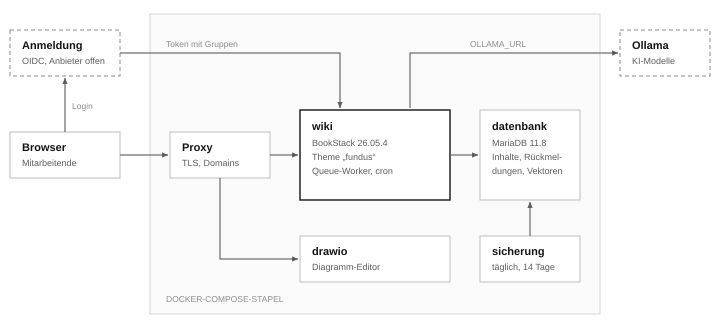
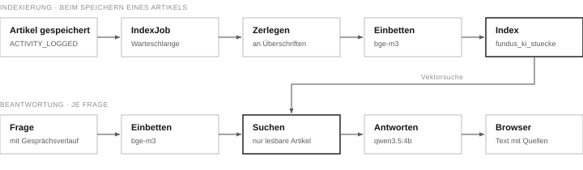

<!--
  So bearbeitest du diese Datei
  ─────────────────────────────
  PDF neu bauen:   node docs/pdf-bauen.mjs
  Kapitel:         # Titel            (automatisch nummeriert, im Inhaltsverzeichnis)
  Unterkapitel:    ## Titel           (automatisch nummeriert, im Inhaltsverzeichnis)
  Anhang:          # Anhang: Titel    (Buchstabe statt Nummer)
  Neue Seite:      eine Zeile mit dem HTML-Kommentar „neue Seite“ vor dem Kapitel
  Einleitung:      der erste Absatz nach einem Kapitel erscheint grau
  Hinweise:        > [!NOTE] / [!TIP] / [!WARNING] / [!CAUTION] in eigener Zeile,
                   darunter > **Titel**, dann der Text (so zeigt GitHub sie als Kästen)
  Bilder:          
  Aussehen:        docs/pdf-stil.css
-->

# Überblick

Fundus ist ein Firmenwiki zum Selbstbetreiben: Anleitungen, Abläufe und Wissen an einem Ort, dazu eine KI, die Fragen aus dem Wiki beantwortet und ausschließlich im Firmennetz läuft.

## Bestandteile

| Teil | Aufgabe |
| --- | --- |
| **Wiki** | BookStack, unverändert, mit eigenem Theme `fundus`: Layout, Startseite, Strg+K-Suche, Kennzahlen |
| **KI-Chat** | beantwortet Fragen nur aus Artikeln, die die Person lesen darf, und nennt die Quelle |
| **Rückmeldungen** | „War das hilfreich?“ und „Veraltet melden“ unter jedem Artikel |
| **Sicherung** | nächtlicher Dump von Datenbank und Uploads |



## Grundsätze

- **BookStack nicht verändern.** Das Theme hängt Bausteine an vorhandene Views an, statt sie zu überschreiben. Ein Update ist meist nur ein neuer Image-Tag.
- **Rechte von BookStack nutzen.** Jede eigene Abfrage läuft über `scopes('visible')`. Listen, Suche und KI zeigen nie mehr, als die Person öffnen dürfte.
- **Keine Daten nach außen.** Schrift im Theme, eigenes draw.io, kein Gravatar, KI auf eigenem Ollama.
- **Namen:** „Fundus“ ist der Produktname. Technische Kennungen heißen `fundus` (Ordner, CSS-Klassen, Routen, Tabellen) und werden nicht umbenannt. Im Wiki heißen Regal, Buch, Kapitel und Seite *Bereich, Thema, Abschnitt, Artikel*.

# Lokal starten

Der ganze Stapel läuft mit Docker Desktop. Das Theme wird direkt aus dem Repo gelesen: speichern, Seite neu laden.

## Einrichten

1. `.env` mit Zufallswerten für Schlüssel und Passwörter und den lokalen Adressen anlegen:

   ```bash
   python skripte/env-anlegen.py --lokal
   ```

2. Starten und nach etwa zwei Minuten `http://localhost:6875` öffnen (`admin@admin.com` / `password`):

   ```bash
   docker compose -p fundus -f docker-compose.yml -f docker-compose.lokal.yml up -d
   ```

3. Rollen, Bereiche und Vorlagen einrichten wie in Kapitel „Betrieb“ beschrieben, mit `--beispiele` für drei Beispielartikel und zwei Beispielkonten.

Die Beispielkonten haben kein Passwort: **Mia Mitarbeiterin** (`mitarbeiter@firma.intern`, Rolle Mitarbeiter) und **Alex Azubi** (`azubi@firma.intern`, Rolle Azubi). Rauchtest und Handbuch-Bilder zeigen das Wiki aus Mias Sicht und finden sie über die E-Mail-Adresse.

## Änderungen prüfen

- **Browser:** Seite neu laden; Fehler in der Konsole, Serverfehler in `/config/log/bookstack/laravel.log`.
- **Rauchtest:** `node skripte/rauchtest.mjs vorher.json` vor, `… nachher.json` nach einer Änderung, dann vergleichen.
- **Theme-Tests:** `bash skripte/testen.sh` prüft Rechte, Rückmeldungen, KI-Suche sowie Sicherung und Wiederherstellung in einem getrennten Teststapel (Kapitel „Stand und offene Punkte“).

> [!CAUTION]
> **Im Container immer als abc arbeiten**
>
> `docker exec` ohne `-u abc` legt Cache-Dateien als root an. Das Wiki kann sie danach nicht mehr beschreiben, einzelne Artikel liefern Fehler 500. Reparatur: Anhang B.

> [!WARNING]
> **Theme-Änderungen sind sofort live**
>
> Halb fertige Änderungen an `functions.php` oder Bausteinen werfen sofort Fehler im laufenden Wiki. Erst fertig schreiben, dann speichern.

<!-- neue Seite -->

# Aufbau des Codes

Alles Eigene liegt im Repo; BookStack selbst kommt unverändert aus dem Image.

## Ordner

```text
fundus/
├── docker-compose.yml        alle Dienste für den Betrieb
├── docker-compose.*.yml      lokal, Teststapel, Keycloak, Anmeldungstest
├── .env.example              alle Variablen mit Erklärung
├── theme/fundus/             das Theme
│   ├── functions.php         Einstieg: Bausteine, Routen, Ereignisse
│   ├── fundus/*.blade.php    Bausteine (Startseite, Chat, Rückmeldung …)
│   ├── public/wiki.js, .css  Verhalten und Gestaltung
│   ├── ki/                   KI-Chat, Fremdbibliotheken in vendor/
│   ├── rueckmeldung/, pruefung/, hinweise/, aktivitaet/
│   │                         Rückmeldungen, Prüffristen, Benachrichtigungen, Aktivität
│   ├── dateitext/            Text aus Anhängen und Bildern (über den Dienst ocr)
│   ├── anmeldung/            Berufstitel (im Wiki gepflegt, optional aus dem OIDC-Token)
│   ├── lang/de_informal/     Begriffe (Bereich, Thema …)
│   └── titel.php, symbole/   Berufstitel, Symbole
├── ocr/, sicherung/          eigene Images für Texterkennung und Sicherung
├── keycloak/                 Realm-Vorlage
├── skripte/                  Einrichtung, .env, Sicherung, Handbuch, Rauchtest
│   └── testen.sh, tests/     Theme-Tests mit Sicherung und Wiederherstellung
├── handbuch/, vorlagen/      Inhalte, die ins Wiki eingespielt werden
├── .github/                  Prüfungen (Actions), Dependabot, Vorlagen für Issues
└── docs/                     diese Doku
```

## So funktioniert das Theme

BookStack lädt bei jeder Anfrage `functions.php`. Dort passiert dreierlei:

1. **Bausteine anhängen:** `renderBefore`/`renderAfter` setzen eigene Blade-Dateien vor oder hinter vorhandene BookStack-Views.
2. **Routen registrieren:** für KI-Chat und Rückmeldungen, mit Anmeldung und CSRF-Schutz von BookStack. Gäste weist `NurAngemeldet` ab, auch wenn in BookStack der öffentliche Zugriff an ist.
3. **Ereignisse abonnieren:** gespeicherte und aus dem Papierkorb geholte Artikel werden für die KI neu eingebettet, Dateien gehen zur Texterkennung.

Im Browser verschiebt `wiki.js` danach vorhandene Elemente (Aktionen über den Inhalt, Kennzahlen unter den Titel). Ohne JavaScript bleibt alles an seinem Platz.

| Baustein | hängt an | Zweck |
| --- | --- | --- |
| `kopf` | `layouts.parts.custom-head` | CSS, `wiki.js`, Personendaten |
| `suche`, `leisten-knopf` | `layouts.parts.header…` | Strg+K-Dialog, Zen-Modus (nur der Artikel, `html.fundus-zen`) |
| `start`, `aktivitaet` | `shelves.parts.list` | Startseite |
| `artikelkopf` | `pages.parts.page-display` | Stand und Lesezeit |
| `rueckmeldung`, `…-details` | `entities.sibling-navigation`, Details | Rückmeldungen |
| `uebersicht`, `liste-kopf`, `liste-rechts` | Brotkrumen, Listen | Kennzahlen |
| `symbol`, `symbole-json` | `entities.grid-item`, Seitenleiste | Symbole aus Schlagwort „Symbol“ |
| `ki` | `layouts.parts.base-body-end` | Chatfenster (nur mit `OLLAMA_URL`) |

## Routen

| Route | Zweck |
| --- | --- |
| `POST /fundus/ki` | Frage stellen, Antwort als Datenstrom |
| `GET /fundus/ki/lauf/{lauf}` | Stand einer laufenden oder eben fertigen Antwort (läuft auf dem Server weiter) |
| `POST /fundus/ki/lauf/{lauf}/stopp` | laufende Antwort abbrechen |
| `GET /fundus/ki/bibliotheken.js` | Markdown, Bereinigung, Code-Hervorhebung für den Chat |
| `POST /fundus/rueckmeldung` | Stimme oder Hinweis speichern |
| `POST /fundus/rueckmeldung/{id}/erledigt` | Hinweis abhaken (nur mit Bearbeitungsrecht) |
| `POST /fundus/gelesen` | Artikel als gelesen vermerken (Aktivität) |
| `POST /fundus/pruefung/{id}` | Artikel als geprüft markieren (nur mit Bearbeitungsrecht) |
| `GET /fundus/hinweise` | Benachrichtigungen der Person abrufen |
| `POST /fundus/hinweise/gesehen` | Benachrichtigungen als gesehen markieren |

## wiki.js und wiki.css

- **wiki.js** (ohne Build) ist in acht Abschnitte gegliedert: Start, frühe Eingriffe, Seitenaufbau, Navigation, Artikel, Personen, KI-Chat, Hilfsfunktionen. Das Inhaltsverzeichnis steht am Dateianfang.
- **wiki.css** (ohne Build) hat Farben als Variablen in `:root`. Abschnitte nicht umsortieren, spätere überschreiben frühere bewusst.

## Theme erweitern

1. Ziel-View im Container unter `/app/www/resources/views` suchen.
2. Baustein in `theme/fundus/fundus/` anlegen, Abfragen immer mit `scopes('visible')`.
3. In `functions.php` einhängen.
4. Gestaltung in `wiki.css`, Klassen mit `fundus-`.
5. Mit Rauchtest, `bash skripte/testen.sh` und einem Konto ohne Bearbeitungsrecht prüfen. Neue Übersichten oder Routen bekommen einen Test in `skripte/tests/theme-tests.php`.

<!-- neue Seite -->

# Funktionen

Die drei eigenen Funktionen im Detail: KI-Chat, Rückmeldungen und das Rechtemodell.

## KI-Chat

Artikel werden an Überschriften in Stücke zerlegt, als Vektoren in MariaDB gespeichert und bei einer Frage durchsucht. Nur die passenden Stücke gehen an das Sprachmodell.



- **Index:** Speichern löst `IndexJob` in der Warteschlange aus; das Speichern wartet nicht auf die KI. Gelöschte Artikel fliegen sofort raus, aus dem Papierkorb geholte kommen wieder hinein. Neuaufbau: `fundus:ki-index` (Anhang B); er entfernt auch Reste von Artikeln, die mit ihrem Thema gelöscht wurden.
- **Anhänge:** Der Text aus Anhängen und Bildern (Abschnitt „Texterkennung“) wird je Datei ein eigenes Stück mit dem Dateinamen als Überschrift, damit er den letzten Abschnitt nicht verwässert.
- **Rechte:** Gesucht wird nur in Artikeln aus `Page::query()->scopes('visible')`, derselben Prüfung wie beim Öffnen.
- **Antwort:** Das Modell antwortet nur aus den Stücken, belegt mit [n] und gibt nie Zugangsdaten aus. Der Browser bereinigt die Ausgabe mit DOMPurify.
- **Verlauf:** Gespräche liegen nur im Browser und werden beim Abmelden gelöscht. Als Zusammenhang gehen die letzten vier Nachrichten mit, je höchstens 4000 Zeichen.

| Stellschraube | Standard | Wirkung |
| --- | --- | --- |
| `KI_MODELL` | qwen3.5:4b | Sprachmodell |
| `KI_EINBETTUNG`, `KI_DIMENSION` | bge-m3, 1024 | Einbettung; nach Wechsel Index mit `--neu` bauen |
| `KI_MAX_ABSTAND` | 0.72 | Treffergrenze; kleiner = strenger |
| Stückgröße in `Ki::zerlegen` | 1 400 Zeichen | kleiner = genauer, weniger Zusammenhang |

## Texterkennung

- Anhänge eines Artikels (PDF, Bild) und Bilder im Artikeltext gehen nach dem Hochladen in der Warteschlange an den Dienst `ocr`. Seiten mit eigenem Text liest er aus, Scans erkennt Tesseract; zu unsichere Wörter und Seiten fallen weg (`OCR_WORT_MIN`, `OCR_SEITE_MIN`).
- Der Text liegt in `fundus_datei_texte` und hängt als eingeklappter Block „Text aus Anhängen und Bildern“ am Artikel. So findet ihn BookStacks Suche mit ihren Rechten; die KI bekommt ihn als eigene Stücke.
- **Bilder zählen nur, solange der Artikel sie zeigt.** BookStack behält ein aus dem Text genommenes Bild in der Galerie; sein Text verschwindet trotzdem beim nächsten Speichern aus Block, Suche und KI.
- Vorhandene Dateien einmalig: `fundus:datei-text` (Anhang B). Code: `theme/fundus/dateitext/Dateitext.php`.

## Rückmeldungen

- Unter jedem Artikel: Stimme (ja/nein, eine je Person) und „Veraltet melden“ mit Grund und Abschnitt.
- Wer den Artikel bearbeiten darf, sieht in den Details Zahlen und offene Hinweise und hakt sie ab.
- Gespeichert in der eigenen Tabelle `fundus_rueckmeldungen`, die der Code selbst anlegt. BookStack-Updates berühren sie nicht; die Sicherung enthält sie.

## Prüfung von Artikeln

- Jeder Artikel hat eine Prüffrist. **Verantwortlich** ist der Besitzer des Artikels (BookStack, änderbar unter „Rechte“).
- **Intervall** in Monaten aus dem Schlagwort `Prüfintervall`: erst am Artikel, dann am Thema, sonst `FUNDUS_PRUEFINTERVALL` (Vorgabe 12). `nie` oder `0` schaltet die Prüfung ab.
- Die Frist zählt ab der letzten Prüfung, bei nie geprüften Artikeln ab dem Anlegen. Bearbeiten zählt bewusst nicht als Prüfung.
- **Anzeige:** Plakette „Prüfung überfällig“ bzw. „Geprüft am …“ im Artikelkopf; in den Details Stand und Knopf „Als geprüft markieren“ (nur mit Bearbeitungsrecht); auf der Startseite der Kasten „Zu prüfen“ mit fälligen und in den nächsten 30 Tagen fälligen eigenen Artikeln.
- Gespeichert als Verlauf in `fundus_pruefungen` (`page_id`, `user_id`, `notiz`, `created_at`). Code: `theme/fundus/pruefung/Pruefung.php`, Route `POST /fundus/pruefung/{id}`.

## Benachrichtigungen durch Fundus

- **Quellen** (`theme/fundus/hinweise/Hinweise.php`, je eine Methode): offene Rückmeldungen „veraltet/falsch“ zu Artikeln, die die Person besitzt (ohne selbst gemeldete, nur lesbare Artikel), und eigene fällige oder bald fällige Prüfungen. Eine neue Quelle liefert Einträge mit `schluessel`, `art`, `dringend`, `titel`, `text`, `adresse`, `zeit`.
- **Neu oder gesehen:** `fundus_hinweise_gesehen` (`user_id`, `schluessel`). Der Schlüssel einer Prüfung enthält das Fälligkeitsdatum, damit die nächste Runde wieder neu ist. Gesehen heißt nicht erledigt; die Kästen auf der Startseite zeigen weiter alles Offene.
- **Oberfläche:** Der Baustein `fundus/hinweise` ist nur ein Halter. `wiki.js` (`hinweise`) holt `GET /fundus/hinweise` nach dem Seitenaufbau und zeigt bei Neuem eine Zahl am runden KI-Knopf und links daneben eine Nachricht; ein Klick darauf öffnet die Karte über dem KI-Knopf (ohne KI unten rechts). „Alles gesehen“ und ein Klick auf einen Eintrag schicken `POST /fundus/hinweise/gesehen`; „Später“ merkt sich die Sitzung.
- Die Texte sind fest formuliert und brauchen kein Ollama.

## Direktlinks zu Abschnitten

`wiki.js` (`ueberschriftenVerlinken`) hängt an jede `h2`–`h4` mit Kennung ein Link-Symbol. Es kopiert `Adresse#bkmrk-…` und setzt die Kennung in die Adresszeile; ohne HTTPS über `execCommand('copy')`. `scroll-margin-top` hält die Überschrift beim Ansprung unter der Kopfleiste.

## Rollen und Rechte

`skripte/einrichten.py` beschreibt Rollen, Bereiche und Freigaben als Daten und darf beliebig oft laufen.

| Rolle | Gruppe | Darf |
| --- | --- | --- |
| Admin | `wiki-admin` | alles |
| Redaktion | `wiki-redaktion` | alle Inhalte, Bereiche, Themen, Rechte, Vorlagen |
| Technik | `wiki-technik` | alle Inhalte lesen und bearbeiten, auch Kunden |
| Mitarbeiter | `wiki-mitarbeiter` | Inhalte nur über Freigaben; keine Kunden |
| Azubi | `wiki-azubi` | wie Mitarbeiter; Kundenthemen nur nach Einzelfreigabe |

| Bereich | Mitarbeiter und Azubis |
| --- | --- |
| Kunden | nicht sichtbar (Azubis: nur freigegebene Themen) |
| Anleitungen & Technik, Prozesse & Richtlinien | lesen und bearbeiten |
| Ausbildung & interne Tools | nur lesen |

> [!NOTE]
> **Was das Skript überschreibt**
>
> Rollen und Bereichsrechte bei jedem Lauf. Themenrechte nur, wenn ein Thema noch keine eigenen hat, damit Einzelfreigaben erhalten bleiben. Inhalte werden nur angelegt, nie überschrieben.

Schaltet ein Admin in BookStack den öffentlichen Zugriff ein, lesen Gäste, was die Rolle „Public“ darf. KI-Chat, Rückmeldungen und Hinweise bleiben angemeldeten Personen vorbehalten.

<!-- neue Seite -->

# Betrieb

Der Stapel läuft mit Docker Compose auf einem Linux-Server. Davor steht ein Reverse Proxy mit TLS (Caddy, nginx, Traefik …), der die Adressen an die Ports des Stapels weiterleitet. Variablen stehen in der `.env`, alles andere im Repo.

## Konfiguration

Alle Variablen mit Erklärung stehen in `.env.example`. `python skripte/env-anlegen.py` legt daraus die `.env` an und setzt Zufallswerte für `APP_KEY`, alle Passwörter und `SICHERUNG_KOPIE_SCHLUESSEL`; eine vorhandene `.env` bleibt unverändert. Die wichtigsten Variablen:

| Variable | Bedeutung |
| --- | --- |
| `APP_URL` | genaue Adresse des Wikis |
| `APP_KEY` | nie ändern, solange Daten existieren; für Wiederherstellung nötig |
| `DB_PASSWORD` | Datenbankpasswort, nur Buchstaben und Ziffern |
| `AUTH_METHOD` | `standard` zur Einrichtung, danach `oidc` |
| `OLLAMA_URL` | Ollama-Server, Vorgabe der Dienst `ollama` im Stapel (`http://ollama:11434`); leer schaltet den KI-Chat ab |
| `KI_MODELL`, `KI_EINBETTUNG` | Sprach- und Einbettungsmodell, Vorgabe `qwen3.5:4b` und `bge-m3`; der Dienst `ollama-modelle` lädt beide beim Start |
| `DRAWIO_URL` | eigenes draw.io; `false` schaltet Diagramme ab |
| `SICHERUNG_UHRZEIT`, `SICHERUNG_TAGE` | Zeitpunkt und Aufbewahrung, Standard 02:30 und 14 Tage |
| `SICHERUNG_KOPIE`, `SICHERUNG_KOPIE_SCHLUESSEL` | Ziel und Schlüssel der verschlüsselten Kopie außer Haus |
| `FUNDUS_WERKZEUGE` | Links zu eigenen Werkzeugen auf der Startseite: `Name\|Adresse\|Beschreibung`, mehrere mit `;` getrennt; leer: kein Kasten |
| `FUNDUS_PRUEFINTERVALL` | Prüffrist in Monaten, Vorgabe 12 |
| `OIDC_NAME`, `AUTH_AUTO_INITIATE` | Beschriftung des Anmeldeknopfes; `true` leitet sofort zum Anbieter weiter |
| `FUNDUS_TITEL_CLAIM`, `FUNDUS_STUFE_CLAIM` | nur, wenn Berufstitel aus dem Anmeldedienst kommen sollen statt aus dem Wiki; dann überschreibt jede Anmeldung den Titel |
| `OCR_WORT_MIN`, `OCR_SEITE_MIN` | Konfidenz 0–100: Wörter darunter fallen weg, Scan-Seiten mit schlechterem Mittel ganz (Vorgabe 50 und 60) |
| `OCR_MAX_SEITEN` | so viele Seiten je PDF, Vorgabe 50 |
| `OCR_URL` | Texterkennung; leer schaltet sie ab |
| `OCR_SPRACHEN` | Sprachen der Texterkennung, Vorgabe `deu+eng`; weitere brauchen ihr Paket in `ocr/Dockerfile` |
| `MAIL_HOST`, `MAIL_PORT`, `MAIL_ENCRYPTION`, `MAIL_USERNAME`, `MAIL_PASSWORD` | SMTP-Server für E-Mails (Benachrichtigungen bei „Beobachten“, Einladungen, Passwort vergessen); ohne `MAIL_HOST` geht keine E-Mail hinaus |
| `MAIL_FROM`, `MAIL_FROM_NAME` | Absender, Vorgabe für den Namen „Fundus“; die Adresse muss der Server senden dürfen |

Fest in `docker-compose.yml` und nicht über die `.env`: `APP_LANG: de_informal` (Du-Form) und `APP_AUTO_LANG_PUBLIC: "false"`. Ohne Letzteres richtet sich die Anmeldeseite nach der Browsersprache und zeigt bei englischem Browser englische Felder unter der deutschen Begrüßung.

Im Wiki selbst unter **Einstellungen → Personalisierung** den Namen des Wikis setzen. Die Startseite „Bereiche“ gibt das Theme vor.

## Ersteinrichtung

1. Repo auf den Server holen, `python skripte/env-anlegen.py` ausführen und in der `.env` die Adressen anpassen (`APP_URL`, `DRAWIO_URL`, `DRAWIO_SERVER_URL`). Starten mit `docker compose -p fundus up -d --build`, dann den Reverse Proxy einrichten (siehe „Reverse Proxy“).
2. Starten, mit `admin@admin.com` / `password` anmelden, Zugangsdaten sofort ändern.
3. Namen des Wikis einstellen (siehe oben).
4. API-Token anlegen und `BOOKSTACK_URL=… BOOKSTACK_TOKEN_ID=… BOOKSTACK_TOKEN_SECRET=… python skripte/einrichten.py` ausführen. `--beispiele` legt zusätzlich drei Beispielartikel im Thema „Microsoft 365“ und die zwei Beispielkonten ohne Passwort an, praktisch zum Ausprobieren von Suche, KI und Rückmeldungen.
5. Die vier Vorlagen von Hand als Vorlage kennzeichnen (die API kann das nicht), Skript erneut starten.
6. Warten, bis `ollama-modelle` die Modelle geladen hat (rund 4 GB; `docker compose logs ollama-modelle`, der Dienst beendet sich danach), dann den KI-Index bauen (Anhang B). Mit eigenem Ollama-Server die Modelle dort laden: `ollama pull qwen3.5:4b` und `ollama pull bge-m3`.
7. Anmeldung anbinden, danach API-Token löschen.

## Reverse Proxy

Nach außen offen sind nur zwei Ports, als Vorgabe nur vom Server selbst erreichbar: `WIKI_PORT`
(`127.0.0.1:6875`) und `DRAWIO_PORT` (`127.0.0.1:6876`), mit Keycloak zusätzlich `KEYCLOAK_PORT`
(`127.0.0.1:8180`). Der Reverse Proxy nimmt die Adressen aus `APP_URL`, `DRAWIO_URL` und `KEYCLOAK_URL`
entgegen, beendet TLS und leitet an diese Ports weiter. draw.io braucht eine eigene Adresse, weil der
Browser es direkt lädt.

Mit [Caddy](https://caddyserver.com/) als `Caddyfile`:

```text
wiki.firma.intern {
    reverse_proxy 127.0.0.1:6875
}
drawio.firma.intern {
    reverse_proxy 127.0.0.1:6876
}
anmeldung.firma.intern {
    reverse_proxy 127.0.0.1:8180
}
```

Caddy setzt `X-Forwarded-Proto` von selbst; BookStack (über `APP_PROXIES`) und Keycloak
(`KC_PROXY_HEADERS`) erkennen daran https. Bei nginx gehört `proxy_set_header X-Forwarded-Proto $scheme;`
(dazu `X-Forwarded-For` und `Host`) in den `location`-Block. Die Antworten des KI-Chats kommen als
Datenstrom; das Wiki schickt dafür `X-Accel-Buffering: no`, woran sich nginx hält. Andere Proxys dürfen
diese Antworten nicht puffern, sonst erscheint die Antwort erst am Ende.

## Anmeldung

Das Wiki meldet über OIDC an. Mitgeliefert ist **Keycloak** mit fertigem Realm; damit ist die Anmeldung
von Anfang bis Ende getestet (`bash skripte/anmeldung-testen.sh`, 11 Prüfungen). Authentik und Entra ID
gehen über dieselben Variablen, sind aber nur nach Doku eingerichtet, nicht getestet.

| Claim im ID-Token | Inhalt | Wofür |
| --- | --- | --- |
| `groups` | `wiki-admin`, `wiki-redaktion`, `wiki-technik`, `wiki-mitarbeiter`, `wiki-azubi` | Rollen. Bei jeder Anmeldung abgeglichen; fällt eine Gruppe weg, fällt die Rolle weg. Groß-/Kleinschreibung egal. |
| `sub` (Entra: `oid`) | unveränderliche Konto-ID | verbindet das Konto im Wiki mit dem im Anbieter |
| `name`, `email` | Anzeigename, E-Mail | Profil |
| `titel`, `titel_stufe` | Berufstitel, Farbe der Plakette (`leitung`, `senior`, `junior`, `azubi`, `team`) | nur mit `FUNDUS_TITEL_CLAIM=titel`, sonst pflegen Admins den Titel im Wiki; ohne Stufe wird sie aus dem Titel abgeleitet |

Als Vorgabe pflegen Admins den Titel im Wiki (*Einstellungen → Benutzer* → Person, Abschnitt „Berufstitel“).
Ist `FUNDUS_TITEL_CLAIM` gesetzt, übernimmt `theme/fundus/anmeldung/Anmeldung.php` ihn stattdessen bei jeder OIDC-Anmeldung in die Tabelle
`fundus_titel`: Die Claims kommen über `OIDC_ID_TOKEN_PRE_VALIDATE`, das Konto über `AUTH_LOGIN`. Fehlt der
Claim, bleibt der gespeicherte Titel; ein leerer Claim löscht ihn.

**Keycloak einrichten**

1. Keycloak mit `docker compose -p fundus -f docker-compose.yml -f docker-compose.keycloak.yml up -d` dazunehmen
   (Keycloak und Postgres), im Reverse Proxy die Keycloak-Adresse an `KEYCLOAK_PORT` weiterleiten. Variablen: `KEYCLOAK_URL` (diese Domain mit `https://`), `APP_URL` (das
   Wiki), `KEYCLOAK_ADMIN_PASSWORD`, `KEYCLOAK_DB_PASSWORD`, `OIDC_CLIENT_SECRET` (`openssl rand -hex 32`).
2. Der erste Start legt aus `keycloak/realm-fundus.json` den Realm `fundus` an: Client `wiki`,
   die fünf Gruppen, Claims `groups`, `titel`, `titel_stufe`. Ein vorhandener Realm wird nicht überschrieben.
3. In Keycloak das eigene Konto anlegen und in `wiki-admin` aufnehmen, **bevor** das Wiki umgestellt wird.
4. Im Wiki: `AUTH_METHOD=oidc`, `OIDC_ISSUER=https://<keycloak>/realms/fundus`, `OIDC_CLIENT_ID=wiki`,
   `OIDC_CLIENT_SECRET` wie oben. `docker compose -p fundus up -d`.

**Konten pflegen** (Keycloak → Realm `fundus` → *Users*): Benutzername, E-Mail, Vor- und Nachname,
*Email verified* an. Unter *Credentials* ein Startpasswort mit *Temporary* (bei der ersten Anmeldung
neu zu setzen), unter *Groups* die passende `wiki-…`-Gruppe, mit `FUNDUS_TITEL_CLAIM` unter *Attributes* auch `titel` und bei Bedarf
`titel_stufe`. Alles gilt ab der nächsten Anmeldung. Wer geht, wird in Keycloak deaktiviert; das Konto
im Wiki bleibt, damit Artikel ihren Autor behalten.

> [!CAUTION]
> **Notfallzugang**
>
> Konten aus Keycloak haben im Wiki kein Passwort. Ist Keycloak weg oder falsch eingestellt, kommt niemand hinein.
>
> 1. In der `.env` `AUTH_METHOD=standard` setzen und `docker compose -p fundus up -d` ausführen.
> 2. Lokales Admin-Konto anlegen: `docker exec -u abc -w /app/www <wiki-container> php artisan bookstack:create-admin --email=notfall@firma.intern --name=Notfall --generate-password`. Das Passwort steht in der Ausgabe.
> 3. Anmelden, Fehler beheben, `AUTH_METHOD=oidc` zurück, `docker compose -p fundus up -d` und das Notfallkonto unter *Einstellungen → Benutzer* löschen.

**Testen:** `bash skripte/anmeldung-testen.sh` startet einen eigenen Stapel mit Keycloak und Test-Zertifikat
(BookStack verlangt https), legt zwei Konten an und prüft Anmeldung, Rollen, Titel, Gruppenentzug,
Abmelden beim Anbieter und falsches Passwort. Mit `--behalten` bleibt er stehen (Wiki `localhost:6877`);
zum Durchklicken im Browser braucht es dann die Zeile `127.0.0.1 keycloak.test` in der hosts-Datei.

**Authentik und Entra ID (ungetestet):** Werte in `.env.example`. Bei Entra `OIDC_EXTERNAL_ID_CLAIM=oid`,
weil `sub` sich mit einer neuen App-Registrierung ändert; Gruppen als Namen (`wiki-…`) im Claim `groups`
(Gruppenanspruch mit `cloud_displayname`). Den Titel liefert Entra nicht von selbst; ohne Claims-Mapping
gilt `titel.php`.

## Update

1. Versionshinweise von BookStack lesen (Theme-Ereignisse, Views, Rechte).
2. Lokal: Rauchtest vorher, Image-Tag erhöhen, neu starten.
3. Prüfen, ob alle Ziel-Views noch existieren (Befehl in Anhang B), Rauchtest nachher, `bash skripte/testen.sh` muss grün sein.
   Eine Vorlage ersetzt das Theme ganz statt nur Bausteine einzuhängen: die Profilseite
   (`theme/fundus/users/profile.blade.php`). Mit BookStacks `resources/views/users/profile.blade.php` der
   neuen Version vergleichen, ob neue Daten oder Abschnitte dazugekommen sind.
   Außerdem füllt das Theme BookStacks leeren Platzhalter `auth/parts/login-message` (Begrüßung auf der
   Anmeldeseite); wiki.css erkennt die Seite an `#login-form`, beides muss es noch geben.
4. Produktiv: sofort sichern, dann `git pull` und `docker compose -p fundus up -d --build`.

## Sicherung und Wiederherstellung

Der Dienst `sicherung` schreibt täglich nach `/sicherungen/<Datum>/`: Datenbank-Dump, Uploads und Prüfsummen.
Jeder Schritt wird geprüft; ein leerer oder abgebrochener Dump wird verworfen und als Fehler gemeldet. Das Image ist
`mariadb:11.8` plus rclone (Ordner `sicherung/`). Der Ordner `skripte/` ist als Ganzes eingebunden, und jede Sicherung
läuft als neuer Prozess: Nach einem `git pull` gilt die neue Fassung der Skripte ohne Neustart.

```bash
docker compose exec sicherung bash /skripte/sicherung.sh jetzt              # sofort sichern
docker compose stop wiki
docker compose exec sicherung bash /skripte/wiederherstellen.sh <Datum>     # zurückspielen
docker compose start wiki
```

`wiederherstellen.sh` leert danach Cache und Sitzungen des Wikis: Der Cache gehört zum alten Stand, und alle melden
sich neu an.

**Kopie außer Haus.** Mit `SICHERUNG_KOPIE` geht jede Sicherung per rclone zusätzlich auf ein zweites System:
SFTP, S3, WebDAV (Nextcloud) oder SMB. Das Ziel steht samt Zugangsdaten in dieser einen Variablen
(Beispiele in `.env.example`); URLs in einfache Anführungszeichen, weil sie selbst Doppelpunkte enthalten.
Nach dem Hochladen vergleicht `rclone check` die Kopie mit der Sicherung; Kopien älter als
`SICHERUNG_KOPIE_TAGE` (90) werden am Ziel gelöscht.

**Verschlüsselung.** Mit `SICHERUNG_KOPIE_SCHLUESSEL` legt rclone ein „crypt“ über das Ziel: Inhalt und
Dateinamen sind verschlüsselt, bevor sie den Server verlassen. Wer Zugriff auf das Ziel hat, sieht nur
Datensalat. Das Zugangspasswort in `SICHERUNG_KOPIE` ist dagegen nur verschleiert (`rclone obscure`), nicht
verschlüsselt, und für alle mit Zugang zur `.env` auf dem Server lesbar. Für das Ziel deshalb ein eigenes Konto, das nur
in diesen Ordner schreiben darf.

> [!CAUTION]
> **Schlüssel sicher aufbewahren**
>
> Ohne `SICHERUNG_KOPIE_SCHLUESSEL` lässt sich die Kopie nie wieder lesen. In den Passwort-Manager und zusätzlich auf Papier an einen zweiten Ort. Ein neuer Schlüssel gilt nur für neue Kopien; alte bleiben mit dem alten lesbar.

**Aus der Kopie wiederherstellen**, etwa nach dem Verlust des Servers: Stapel neu aufsetzen, dieselben
Variablen (auch `APP_KEY` und den Schlüssel), dann

```bash
docker compose exec sicherung bash /skripte/sicherung.sh holen             # Kopien auflisten
docker compose exec sicherung bash /skripte/sicherung.sh holen <Datum>     # holen, entschlüsseln, Prüfsummen prüfen
docker compose stop wiki
docker compose exec sicherung bash /skripte/wiederherstellen.sh <Datum>
docker compose start wiki
```

**Meldung an Admins.** Nach jedem Lauf steht in `status.json`, wie es ausging. Das Wiki liest die Datei
(Volume nur lesend unter `/fundus-sicherungen`), und Fundus meldet Admins:

| Lage | Hinweis |
| --- | --- |
| Sicherung oder Kopie gescheitert | dringend, mit der Meldung aus dem Protokoll |
| seit über 26 Stunden keine Sicherung | dringend: der Dienst läuft vermutlich nicht |
| `SICHERUNG_UHRZEIT` ungültig | dringend, schon beim Start des Dienstes |
| keine Kopie außer Haus | ruhig, bleibt stehen, bis es eine gibt |
| Kopie unverschlüsselt | ruhig, bleibt stehen, bis ein Schlüssel gesetzt ist |

Zugangsdaten erscheinen weder im Protokoll noch im Status: rclone schreibt sie in Fehlermeldungen mit,
`ohne_geheimnisse` in `sicherung.sh` ersetzt die ganze Zeichenkette durch „<Ziel>“, Passwörter, Schlüssel
und Zugangsdaten in URLs durch „***“. Der Rechnername des Ziels bleibt stehen; er hilft bei der Fehlersuche.

> [!NOTE]
> **Getestet**
>
> `bash skripte/testen.sh` spielt eine Sicherung in einen leeren Teststapel zurück und kopiert danach verschlüsselt auf ein WebDAV-Ziel im Teststapel: Auf dem Ziel sind keine Namen lesbar, die zurückgeholte Kopie besteht ihre Prüfsummen, ein ausgefallenes Ziel steht als Fehler im Status, ohne Zugangsdaten und Schlüssel. Auf dem Server einmal von Hand wiederholen.

## Handbuch pflegen

Handbuch-Artikel liegen als HTML in `handbuch/`, die Struktur in `einrichten.py`. Die meisten Bilder entstehen automatisch aus dem laufenden Wiki mit den Beispielinhalten und -konten aus `einrichten.py --beispiele` (`skripte/handbuch-bilder/bilder.mjs` beschreibt Seite, Person, Markierungen und Ausschnitt). Ausnahme sind die Bilder `editor-*.png`: Der Editor lädt Bilderliste, Vorlagen und Anhänge erst nach, und die Aufnahme läuft ohne Anmeldung im Browser. Diese Bilder werden von Hand aufgenommen; fehlt eines, überspringt das Einspielen den Verweis.

```bash
node skripte/handbuch-bilder/aufnehmen.mjs          # Screenshots neu aufnehmen
bash skripte/handbuch-einspielen.sh --trockenlauf   # prüfen
bash skripte/handbuch-einspielen.sh                 # einspielen
```

Die Vorstellungsbilder (sieben Folien, 1600 × 2000 px) entstehen genauso aus dem laufenden Wiki, ohne
Markierungen. `skripte/vorstellung/bauen.mjs` setzt sie mit Überschrift zusammen und legt sie mit
`fundus-vorstellung.pdf` in `docs/vorstellung/` ab. Der Ordner ist nicht eingecheckt: Die Folien zeigen einen festen
Stand und werden an das jeweilige Release gehängt. Für die Dauer der Aufnahme legt es Beispieldaten
an (gelesene Artikel für Mia, eine Rückmeldung von Alex) und löscht sie danach wieder.

```bash
node skripte/vorstellung/bauen.mjs                  # alle Folien und das PDF
node skripte/vorstellung/bauen.mjs 3                # nur Folie 3
```

# Stand und offene Punkte

Stand 24.09.2026.

## Tests

| Prüfung | Stand |
| --- | --- |
| Theme lädt ohne Fehler (`rauchtest.mjs`) | automatisiert, lokal |
| Syntax PHP, JS, Python, Shell, JSON; Compose-Dateien; Images `ocr` und `sicherung` | automatisiert (GitHub Actions, `.github/workflows/pruefen.yml`) |
| Rechte: Mitarbeiter, Azubi, Einzelfreigabe, Übersichten, Symbole, KI-Quellen, Gäste bei öffentlichem Zugriff | automatisiert (`testen.sh`) |
| Rückmeldungen, Prüfung von Artikeln, Benachrichtigungen, Aktivität und Serie, KI-Zerlegung und -Suche, Papierkorb | automatisiert (`testen.sh`) |
| Texterkennung: Block, Suche, Rechte, entfernte Bilder, Stücke für die KI | automatisiert (`testen.sh`) |
| Sicherung anlegen, in leeren Stapel zurückspielen, bei angehaltenem Wiki erneut zurückspielen | automatisiert (`testen.sh`) |
| Abgebrochener Dump und ungültige Uhrzeit landen als Fehler im Status | automatisiert (`testen.sh`) |
| Kopie außer Haus: verschlüsselt, zurückholen, Ausfall des Ziels, keine Geheimnisse im Status | automatisiert (`testen.sh`) |
| Hinweise zur Sicherung an Admins | automatisiert (`testen.sh`) |
| Berufstitel aus dem Token | automatisiert (`testen.sh`) |
| Anmeldung über Keycloak: Rollen, Gruppenentzug, Abmelden | automatisiert (`anmeldung-testen.sh`) |

`bash skripte/testen.sh` legt im lokalen Wiki eine Sicherung an, spielt sie in einen getrennten Stapel `fundus-test` zurück (Abgleich der Anzahl von Einträgen und Bildern) und führt dort `skripte/tests/theme-tests.php` aus. Danach wird der Teststapel samt Volumes entfernt. Ollama wird nicht gebraucht, die Tests setzen feste Vektoren ein. `--behalten` lässt den Stapel stehen, `--nur-tests` testet im stehenden Stapel erneut.

## Vor dem Produktivstart

| Punkt | Notiz |
| --- | --- |
| Ziel für die Kopie außer Haus festlegen | SFTP, S3, Nextcloud oder SMB; `SICHERUNG_KOPIE` und `SICHERUNG_KOPIE_SCHLUESSEL` setzen |
| Wiederherstellung auf dem Server üben | lokal automatisch getestet, auf dem Server einmal von Hand, auch aus der Kopie (`sicherung.sh holen`) |
| Namen des Wikis setzen, Handbuch einspielen | `bash skripte/handbuch-einspielen.sh` |
| Mailversand einrichten | `MAIL_HOST`, `MAIL_FROM` und Zugangsdaten; sonst kommen keine Benachrichtigungen bei „Beobachten“ |
| `APP_KEY` und `SICHERUNG_KOPIE_SCHLUESSEL` sichern | im Passwort-Manager, den Schlüssel zusätzlich auf Papier |

## Später

- E-Mail zusätzlich zur Nachricht im Wiki
- Englische Oberfläche (Theme-Texte sind nur deutsch)
- Name der KI („Fundus“) einstellbar machen

<!-- neue Seite -->

# Anhang: Fallstricke

Probleme, die schon einmal Zeit gekostet haben. Bei merkwürdigem Verhalten zuerst hier nachsehen.

| Symptom | Ursache und Lösung |
| --- | --- |
| Einzelner Artikel liefert Fehler 500 | Cache gehört root. Besitz reparieren (Anhang B), immer `docker exec -u abc`. |
| Theme-JavaScript läuft nicht | BookStack rät den Dateityp falsch. JS steht deshalb inline in `kopf.blade.php`. |
| Kopfleiste scrollt mit | `body { height: 100% }` nicht setzen. |
| Symbole als graue Flächen | CSS-`fill` überstimmt SVG-Attribute; Linien-Symbole mit `fill: none`. |
| Standardvorlage per API nicht setzbar | Vorlage von Hand kennzeichnen, `einrichten.py` erneut starten. |
| Skript bricht mit 429 ab | API-Limit 180/min; `einrichten.py` wartet automatisch. |
| KI-Antwort kommt erst am Ende | Puffer im Proxy abschalten (`X-Accel-Buffering: no`). |
| KI findet neue Artikel nicht | Warteschlange oder Ollama prüfen, Index von Hand bauen. |
| KI-Chat meldet kurz nach dem ersten Start einen Fehler | `ollama-modelle` lädt noch; `docker compose logs ollama-modelle`. Danach den Index bauen. |
| KI antwortet sehr langsam | Ollama rechnet auf der CPU. Mit NVIDIA-Grafikkarte den `deploy`-Block beim Dienst `ollama` einkommentieren. |
| SQL-Fehler nach Modellwechsel | `KI_DIMENSION` passt nicht; Index mit `--neu` bauen. |
| Leere Variable in `.env` wirkt im Wiki wie „nicht gesetzt“ | PHP-FPM reicht leere Umgebungsvariablen nicht durch; es greift die Vorgabe im PHP-Code. Die muss deshalb dasselbe bedeuten wie „leer“ (Beispiel `FUNDUS_TITEL_CLAIM`). Theme-Tests laufen per CLI und sehen die leere Variable. |
| Container nutzt nach `git pull` die alte Fassung einer Datei | Einzeln gemountete Dateien hängen an der alten Datei, weil Git Dateien ersetzt statt überschreibt. Ordner mounten (wie `skripte/` im Dienst `sicherung`). |
| Direkte SQL-Abfrage auf `pages` scheitert | Seit BookStack 26 liegen Inhalte in `entities` und `entity_page_data`. In Skripten die Modelle oder diese Tabellen verwenden. |

# Anhang: Befehle

Mit dem Projektnamen `fundus` (`-p fundus`) heißt der Container `fundus-wiki-1`, lokal wie im Betrieb.

```bash
# Stapel lokal
docker compose -p fundus -f docker-compose.yml -f docker-compose.lokal.yml up -d
docker exec fundus-wiki-1 tail -n 100 /config/log/bookstack/laravel.log

# KI-Index bauen (--neu nach Modellwechsel)
docker exec -u abc -w /app/www fundus-wiki-1 php artisan fundus:ki-index

# Texterkennung für vorhandene Anhänge und Bilder (--neu: auch schon erkannte, etwa nach neuen Schwellen)
docker exec -u abc -w /app/www fundus-wiki-1 php artisan fundus:datei-text

# Prüfen
bash skripte/testen.sh
node skripte/rauchtest.mjs
node --check theme/fundus/public/wiki.js

# Ziel-Views nach einem Update prüfen
for v in layouts/parts/{custom-head,header-links,header,base-body-end} \
         pages/parts/{page-display,show-sidebar-section-details} \
         entities/{sibling-navigation,breadcrumbs,grid-item} \
         {books,shelves}/parts/{list,index-sidebar-section-actions} \
         books/parts/show-sidebar-section-shelves users/parts/form \
         auth/parts/login-message users/profile; do
  docker exec fundus-wiki-1 test -f /app/www/resources/views/$v.blade.php || echo "FEHLT: $v"
done

# Reparatur: Dateien gehören root
docker exec fundus-wiki-1 sh -c '
  find -L /app/www/storage/framework /app/www/bootstrap/cache ! -user abc -exec chown abc:users {} +
  chown -R abc:users /config/www/uploads /config/www/files /config/www/images'

# Diese Doku als PDF
node docs/pdf-bauen.mjs
```
